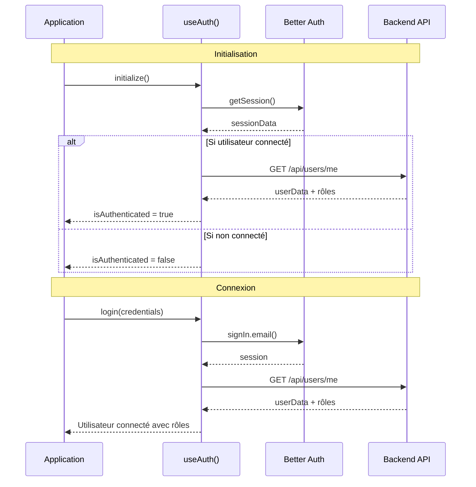

# Intégration API utilisateur - Test et Documentation

## Modifications apportées

### 1. Création de `user.api.ts` ✅

- **Endpoint** : `GET /api/users/me`
- **Interface** : `UserResponse` avec les types appropriés
- **Export** : API utilisateur prête à l'emploi

### 2. Amélioration du composable `useAuth` ✅

#### Nouvelles propriétés réactives :

- `appUserData` : Données complètes de l'utilisateur
- `appUser` : Computed pour accès facile aux données utilisateur
- `isAdmin` : Vérifie si l'utilisateur est admin ou super admin
- `userRole` : Rôle actuel de l'utilisateur
- `isSuperAdmin` : Basé sur le vrai rôle de la DB

#### Fonction `fetchUserData()` :

- Récupère les données depuis `/api/users/me`
- Met à jour `appUserData.value`
- Gestion d'erreurs appropriée

#### Logique d'authentification mise à jour :

```typescript
// Avant
const isAuthenticated = computed(() => !!sessionData.value?.data?.user)
const isSuperAdmin = computed(() => currentUser.value?.role === 'admin' || false)

// Maintenant
const isAuthenticated = computed(() => !!sessionData.value?.data?.user && !!appUserData.value)
const isSuperAdmin = computed(() => appUserData.value?.role === 'super_admin' || false)
```

### 3. Flux d'authentification complet



### 4. Nouvelles fonctionnalités disponibles

```typescript
const {
  appUser, // Données complètes utilisateur
  userRole, // 'player' | 'tournament_admin' | 'super_admin'
  isAdmin, // true si admin ou super admin
  isSuperAdmin, // true si super admin uniquement
  isAuthenticated, // true si session ET données utilisateur
} = useAuth()

// Exemple d'utilisation
if (isSuperAdmin.value) {
  // Accès admin complet
}

if (isAdmin.value) {
  // Accès gestion tournois
}

console.log('Rôle utilisateur:', userRole.value)
console.log("Nom d'affichage:", appUser.value?.displayName)
```

### 5. Points importants

1. **Double vérification** : `isAuthenticated` vérifie maintenant la session ET les données utilisateur
2. **Récupération automatique** : Les données utilisateur sont récupérées à l'initialisation et après connexion/inscription
3. **Gestion d'erreurs** : Si `/users/me` échoue, l'application continue de fonctionner
4. **Nettoyage** : Toutes les données sont nettoyées à la déconnexion

### 6. Tests à effectuer

- [ ] Connexion → vérifier que `appUser` est bien rempli
- [ ] Inscription → vérifier que les rôles sont corrects
- [ ] Rafraîchissement page → vérifier l'initialisation
- [ ] Déconnexion → vérifier le nettoyage des données
- [ ] Guards router → vérifier avec les nouveaux rôles
